<!-- Profile repository: dhruvkhatri01/dhruvkhatri01 | Branch: main -->

<picture>
  <source media="(prefers-color-scheme: dark)" srcset="./dark.svg" />
  <source media="(prefers-color-scheme: light)" srcset="./light.svg" />
  
</picture>

<h1 align="center">Hi, I'm Dhruv Khatri 👋</h1>

  <strong>Full-Stack Developer · Cyber Security Analyst</strong> 
  Mumbai, India · Building + Learning + Shipping

## About me

I build web and mobile applications and explore how to make them more secure.
My interests connect full-stack development with vulnerability assessment,
penetration testing, and application security.

- **Development:** React, React Native, Node.js, PHP, and Python.
- **Security:** VAPT, application security, and Linux hardening.
- **Approach:** Build useful projects, understand how they work, and keep improving.

## My toolkit

| Area | Technologies |
| --- | --- |
| Web & mobile | React.js, React Native |
| Backend & scripting | Node.js, PHP, Python |
| Databases | PostgreSQL, MongoDB, MySQL |
| Tools & platforms | VS Code, Android Studio, Git, Vercel |
| Operating systems | Linux, Kali Linux |

## GitHub activity

<!-- The stats workflow creates the four profile/*.svg files after its first successful run. -->

  
   
  <picture>
    <source media="(prefers-color-scheme: dark)" srcset="./profile/stats-dark.svg" />
    
  </picture>
  <picture>
    <source media="(prefers-color-scheme: dark)" srcset="./profile/top-langs-dark.svg" />
    
  </picture>

Language shares reflect repository code volume, not proficiency. Cards update periodically.

## Contribution snake

<!-- The snake workflow must succeed before these output-branch images are available. -->

  <picture>
    <source media="(prefers-color-scheme: dark)" srcset="https://raw.githubusercontent.com/dhruvkhatri01/dhruvkhatri01/output/github-snake-dark.svg" />
    <source media="(prefers-color-scheme: light)" srcset="https://raw.githubusercontent.com/dhruvkhatri01/dhruvkhatri01/output/github-snake.svg" />
    
  </picture>

## Connect with me

Social links coming soon.

<!-- Add your public links to social-links.json and run python tools/build_readme.py. -->
